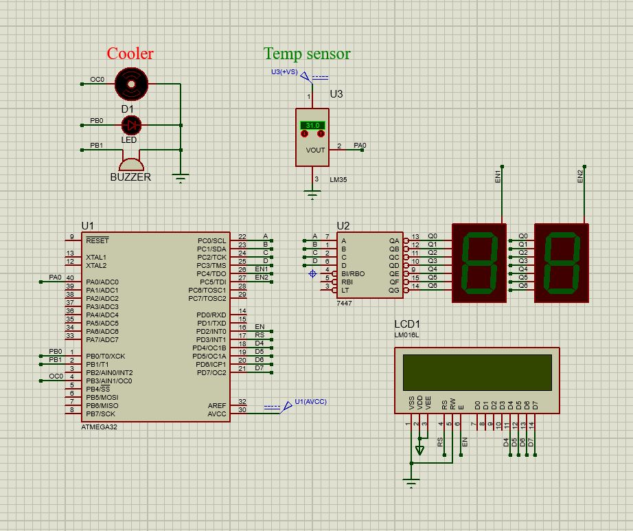

<h1 align="center"> Cooler system </h1>

 Embedded systems projects monitors temperature and cool the system automatically   

<h2> Requirements </h2>

- Main function: run a cooler (DC motor) with a speed which increased when temperature increased and will start to run if the 
temperature is greater than 35C.

- System consists of:  cooler system (DC motor), LED, buzzer, temperature sensor (LM35), LCD and 2 seven segments.

<h2> Details </h2>

- Cooler, buzzer and LED will be on when temperature is more than 35C and off when less than 35C.

- Temperature should be appeared on LCD first row and also in seven-seg.

- Cooler speed (duty cycle) should be appeared in second row.

- Cooler system is consists of 5volt DC motor, when the range of temperature is from 35c to 50c the cooler Dc volt 
should be from 2.5 to 5 volt.

<h2> System design </h2>

 
